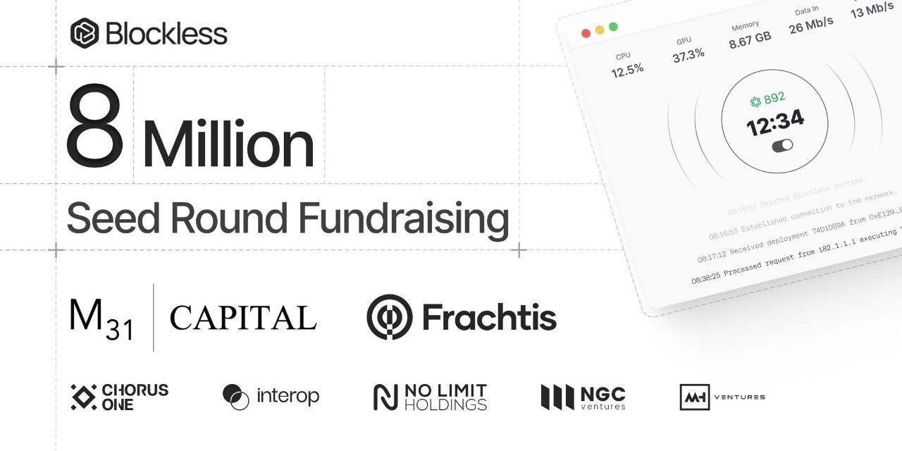

## BLOCKLESS BLESS NETWORK BOT



This script automates network or node operations for Blockless Bless Network Bot.

## FEATURES

- **Automated node interaction**
- **Multi account**
- **Multi NodeID**
- **Proxy support**

## PREREQUISITE

- Git
- [Node.js](https://nodejs.org/) (version 12 or higher)

## INSTALLATION

1. Clone the repository to your local machine:
   ```bash
   git clone https://github.com/Rambeboy/bless-network-bot.git
   ```

2. Navigate to the project directory:
   ```bash
   cd bless-network-bot
   ```

3. Install the necessary dependencies:
   ```bash
   npm install
   ```

4. Configure the app:
   ```bash
   nano config/config.js
   ```

5. Run the script:
   ```bash
   npm start
   ```


## USAGE

1. Register to blockless bless network account first, if you dont have you can register [Here](https://bless.network/dashboard)

2. Set and Modify `config.js`. Below how to setup this file. Put your `B7S_AUTH_TOKEN (usertoken)`, `nodeid` and `hardwareid` in the file. Below how to get it:

3. To get your `token/usertoken`, follow this step:

- Login to your bless account in `https://bless.network/dashboard`, make sure you is in this link (dashboard) before go to next step

- Go to inspect element, press F12 or right-click then pick inspect element in your browser

- Go to application tab - look for Local Storage in storage list -> click `https://bless.network` and you will see your B7S_AUTH_TOKEN.

- Or you can go Console tab and paste this 
	```bash
	localStorage.getItem('B7S_AUTH_TOKEN')
	```

4. To get your `nodeid` and `hardwareid`, follow this step:

- Download the [extension](https://chromewebstore.google.com/detail/bless/pljbjcehnhcnofmkdbjolghdcjnmekia)

- After you download the extension, open `chrome://extensions/?id=pljbjcehnhcnofmkdbjolghdcjnmekia`

- Enable `Developer mode` in top right, then press `service worker`. You will see new tab open.


- Go to `network` tab, then open the `Bless extension` and login to your account.

- After you login to your account, search name with your pubkey (example : `12D3xxxx`), open and copy the `pubkey` and `hardwareid`


5. If you want to use `proxy`, you can add in the config file for each nodeid.

6. Put all data of `usertoken`, `nodeid` and `hardwareid` in the `config.js`, it will look like this:
   ```bash
	module.exports = [
	    {
	        usertoken: 'usertoken1',
	        nodes: [
	            { nodeId: 'nodeid(pubkey)1', hardwareId: 'hardwareid1', proxy: 'proxy1' },
	            { nodeId: 'nodeid(pubkey)2', hardwareId: 'hardwareid2', proxy: 'proxy2' },
	            { nodeId: 'nodeid(pubkey)3', hardwareId: 'hardwareid3', proxy: 'proxy3' },
	            { nodeId: 'nodeid(pubkey)4', hardwareId: 'hardwareid4', proxy: 'proxy4' },
	            { nodeId: 'nodeid(pubkey)5', hardwareId: 'hardwareid5', proxy: 'proxy5' }
	        ]
	    },
	    {
	        usertoken: 'usertoken2',
	        nodes: [
	            { nodeId: 'nodeid(pubkey)6', hardwareId: 'hardwareid6', proxy: 'proxy6' }
	        ]
	    }
       // If you only use 1 account, delete all sequences after that.
   ];
   ```


## NOTE

- The total time is refreshed every 10minute connection, One account only can have 5 nodeid max and can't be deleted, I recomended to save your Nodeid(pubkey) and hardwareid of your account.

- This script only for testing purpose, using this script might violates ToS and may get your account permanently banned.


## LICENSE

This project is licensed under the MIT License. See the [LICENSE](LICENSE) file for more details.

---
